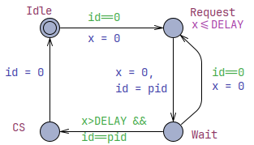
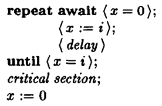

# Concurrency Exercises

Learning goals:
 - Practice the concurrency features.
 - Build higher abstraction concurrency constructs.
 - Implement a concurrency protocol.

## Thread-Protected Queue

Consider a queue class template for a producer-consumer problem:

1. Run benchmark [mtqueue_bm.cpp](tests/mtqueue_bm.cpp) in optimized **Release** configuration:
   1. Observe that **mtqueue** in [mtqueue.hpp](include/mtqueue.hpp) uses `std::list`, run `mtqueue_bm` and record the results.
```
---------------------------------------------------------------
Benchmark                    Time             CPU   Iterations
---------------------------------------------------------------
mtqueue_bm/100            1947 ns         1943 ns       361184
mtqueue_bm/1000          20675 ns        20640 ns        33928
mtqueue_bm/10000        222410 ns       221782 ns         3154
mtqueue_bm/100000      2250013 ns      2246110 ns          309
mtqueue_bm/1000000    22334137 ns     22312032 ns           31
mtqueue_bm/10000000  239038388 ns    238293667 ns            3
```


   2. Change **mtqueue** in [mtqueue.hpp](include/mtqueue.hpp) to use `std::deque` instead of `std::list`, rerun `mtqueue_bm` and record the results.

```
--------------------------------------------------------------
Benchmark                    Time             CPU   Iterations
--------------------------------------------------------------
mtqueue_bm/100             162 ns          162 ns      4334714
mtqueue_bm/1000           1548 ns         1532 ns       460290
mtqueue_bm/10000         15052 ns        15030 ns        46576
mtqueue_bm/100000       155010 ns       154840 ns         4537
mtqueue_bm/1000000     1566374 ns      1564053 ns          450
mtqueue_bm/10000000   15758818 ns     15736545 ns           44 
```

   3. Compare the benchmark results: which data structure is better for this use case? Why?
      - **std::list**
        - Is a doubly linked list. 
        - Each element is stored in a separate node. 
        - Every node also stores pointers. 
        - Traversing it means following pointers from one memory location to another.
        - Causes: Poor CPU cache usage
      - **std::deque**
        - Stores elements in blocks of contiguous memory.
        - Elements are much closer together in memory.
        - Iteration touches memory more sequentially.
        - Causes: Better cache locality + 
2. Solve `TODO` in [mtqueue.cpp](src/mtqueue.cpp):
   1. Create a shared queue of messages. 
   2. Create a producer which puts messages to the container.
   3. Create a consumer printing the messages to `std::cout`.
   4. Create multiple asynchronous producers.
   5. Verify the code against concurrency issues (run many threads for many data)
      - Linux/macOS: consult with `ThreadSanitizer` (add `-DTSAN=ON` to `cmake` configuration step).
      - Windows/MSVC: try [AppVerifier](https://learn.microsoft.com/en-us/windows-hardware/drivers/devtest/application-verifier)
6. Fix the "mtqueue" to ensure thread-safety in [mtqueue.hpp](include/mtqueue.hpp):
   1. Solve data race by using [mutual exclusion](https://en.cppreference.com/w/cpp/thread/mutex).
   2. Change `mtqueue::get` to always return a concrete value instead of `std::optional`. 
   3. Change `mtqueue::get` to block and wait until the queue is not empty, use [condition variable](https://en.cppreference.com/w/cpp/thread/condition_variable) to signal between threads.
   4. Check for concurrency issues 
   5. Rerun `mtqueue_bm` benchmark, record the results and compare with previous results.

```
--------------------------------------------------------------
Benchmark                    Time             CPU   Iterations
--------------------------------------------------------------
mtqueue_bm/100            1088 ns         1083 ns       633158
mtqueue_bm/1000          10465 ns        10427 ns        67419
mtqueue_bm/10000        103781 ns       103493 ns         6762
mtqueue_bm/100000      1047438 ns      1046253 ns          660
mtqueue_bm/1000000    11441359 ns     10775970 ns           67
mtqueue_bm/10000000  105342507 ns    105223667 ns            6
```

## Futures and Promises

Implement `TODO` requirements in [future.cpp](src/futures.cpp).

## Monadic `and_then`

`std::future` lacks monadic member functions like `and_then` which would apply another function object on its future result when it becomes available. Instead, please provide a non-member function template `std::future<Res> and_then(std::future<T>&& input, Fn&& fn)`, which applies `fn` on the data from `input` asynchronously (on a different thread) and returns another `std::future` result.

Assume that `fn` returns `Res` when applied on `T` (see [`std::invoke_result_t`](https://en.cppreference.com/w/cpp/types/result_of)).

Implement and apply `and_then` in [futures.cpp](src/futures.cpp).

## Thread Pool

Implement a thread pool class template to pre-allocate a specified number of threads.

1. Constructor creates a number of threads waiting for tasks.
2. Use container (e.g. `std::queue`) of `std::function<void()>` to store tasks.
3. Use `std::mutex` and `std::condition_variable` to protect the task queue.
4. Destructor should notify all waiting threads to terminate and joins them.
5. Provide `async` method template similar to `std::async` to add tasks.
   - Use perfect capture or `std::tuple` to store function and arguments into lambda.
   - Use `std::promise` to return the value to a `std::future`.
   - Use `std::shared_ptr` to capture `std::promise` into lambda.
6. Test the thread pool with producers and consumers from the "Thread-Protected Queue" exercise above in [mtqueue.cpp](src/mtqueue.cpp).

## Fischer's Protocol
The goal is to implement [Fischer's mutual exclusion protocol](https://doi.org/10.1145/7351.7352) using C++ concurrency features without `std::mutex` and find the minimal timing constraints where the protocol still works on your platform.
The images below show a timed automaton ("state chart" with one clock variable) and original algorithm describing the protocol:




Initially the process is in **Idle** state (doing something else independently of other processes).
Then the process has to go through **Request** and **Wait** states in order to get into **CS** (*Critical Section*) where only one process at most is allowed to be (otherwise it may create data race).

Here is how the protocol works:
 - From the **Idle** state the process can transition to **Request** only when the shared atomic variable `id` is empty (contains value zero), then the clock `x` is reset to `0` and starts counting the time from then.
 - From the **Request** state the process can transition to **Wait** at any time by resetting the clock `x` and storing its process identifier `pid` into the shared variable `id`. The process cannot stay in **Request** for more than `DELAY` amount of time after it has arrived (the clock `x` must not exceed constant `DELAY` while the process is in the **Request** state).
 - The **Wait** state is similar to **Idle** in a sense that the process can wait there for arbitrary amount of time (there is no rush as in **Request**). The process can transition to *Critical Section* **CS** state after its `pid` value has stayed in the `id` variable (`id==pid`) for *strictly longer* than `DELAY` amount of time (`x>DELAY`).
 - The process can stay in **CS** for as long as it needs the exclusive access. The process moves on to its business in **Idle** state by resetting the shared atomic variable `id` to zero value, which signals that the critical section is available to others.

The protocol is parameterized with a constant `DELAY` and some small duration `ε` for busy loops in **Idle** and **Wait** states.

Your task is to program the protocol in C++ and find out the minimal value of `DELAY` that the protocol still works in a sense that no two processes arrive into critical section. The whole system also should not arrive into a deadlock ("hang").

Proposed plan to implement in [fischer.cpp](src/fischer.cpp):
 - Create a critical section monitor: a class with methods `enter()` and `leave()` which track how many processes are in the critical section and throw an exception if more than one process has entered the critical section at the same time.
 - Create a function for the threads to execute:
   - use `int` parameter to pass a unique process identifier,
   - share the atomic variable `id` for storing the process identifiers,
   - share the critical section monitor,
   - model the states described in the Fischer's protocol,
   - make a guess for the constant `DELAY` value,
   - there are no *clock* variables in C++, so use [std::this_thread::sleep_for](https://en.cppreference.com/w/cpp/thread/sleep_for.html) to delay for appropriate amount of time,
   - use minimal or no delays when the protocol asks to wait for an arbitrary amount of time: we want to get to the critical section as soon as possible and also to stress-test the protocol with least waiting,
   - use a shared instance of a critical section monitor,
   - call `enter()` and `leave()` methods accordingly when entering and leaving the critical section with a tiny delay in between. 
   - perform a selected number of rounds (e.g. 1000) before exiting the function while in the **Idle** state.
 - Minimize the memory access interference of your shared data structures.  
 - Launch 4 times more threads than [the number of CPU cores available on your computer](https://en.cppreference.com/w/cpp/thread/thread/hardware_concurrency.html). The program should terminate after a while (there should not be deadlocks). 
 - Observe the result, adjust the `DELAY` constant and rerun the experiment:
   - Increase the value of `DELAY` if critical section violation is detected.
   - Decrease the value of `DELAY` if no violation is detected.
 - Record the minimal `DELAY` value that the protocol works on your machine, compare it with other timings on your computer, like RAM CAS latency.
 - Extra: create your own mutex device by refactoring the process function body into `lock()` and `unlock()` methods.
 