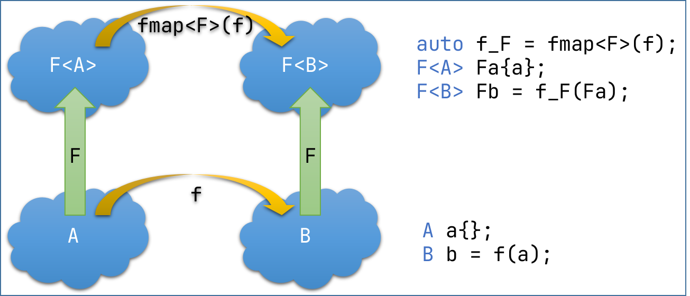
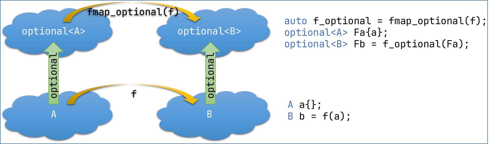
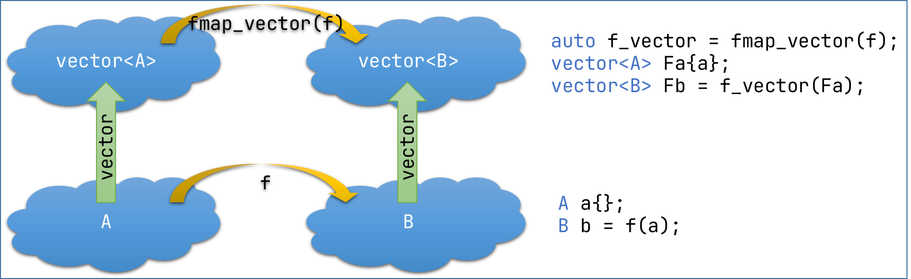

# Functor Design Pattern

Inspired by [Bartosz Milewski](https://bartoszmilewski.com/2015/01/20/functors/).

Goals:
* Practice STL containers and algorithms.
* Practice template metaprogramming.
* Use lambda expressions in an advanced way.

Build and test:
```shell
cmake -B build-debug -DCMAKE_BUILD_TYPE=Debug
cmake --build build-debug --config Debug
ctest --test-dir build-debug -C Debug
```

## Context

Functor design pattern uses functor `fmap<F>` to lift a function `f` from `A` to `B` to a function `fmap<F>(f)` from `F<A>` to `F<B>`.


C++ uses templates to create types out of underlying types. In particular:
- `std::optional<T>` is a generic type denoting an optional value of type `T` (corresponds to "Maybe" monad in Haskell). `fmap_optional` implements a functor which takes any function `f` from `A` to `B` and returns a function from `std::optional<A>` to `std::optional<B>`, where the computation from `A` to `B` is performed by `f` provided that `std::optional<A>` argument has a value.
  
- `std::vector<T>` is the most popular container for elements of type `T`. `fmap_vector` implements a functor which takes any function `f` from `A` to `B` and returns a function which takes `std::vector<A>` and returns `std::vector<B>`, where the transformation of each element from `A` to `B` is computed by the original function `f`.
  

Note that the above functors can also be composed to create a function from `std::vector<std::optional<A>>` to `std::vector<std::optional<B>>` when supplied with a function `f` from `A` to `B`.

## Assignment

1. Build and run `fmap_optional_test`, observe that the test passes.
2. Get acquainted with how fmap_optional works in [fmap_optional.hpp](include/fmap_optional.hpp).
3. Implement fmap_vector in [fmap_vector.hpp](include/fmap_vector.hpp):
   1. Uncomment static_assert tests in [fmap_vector_test.cpp](tests/fmap_vector_test.cpp).
   2. Implement is_vector meta-predicate to check if the type is an instance of std::vector until the test `fmap_vector_test` compiles.
   3. Uncomment runtime test cases in [fmap_vector_test.cpp](tests/fmap_vector_test.cpp). 
   4. Implement fmap_vector function template until the test `fmap_vector_test` passes.
