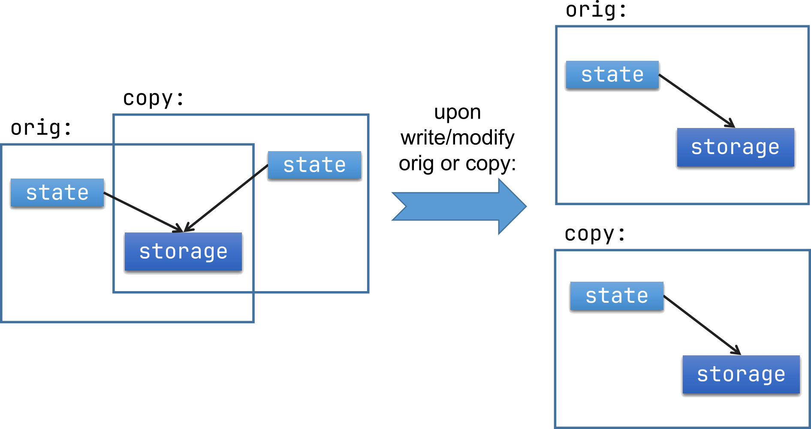

# Polyline with Copy-on-Write (CoW) Semantics

Learning objectives:
- Practice special member functions, namespaces and project structure.
- Learn about a memory usage optimization technique (Copy-on-Write).

## Problem
Some data structures are large and expensive to move around, and in such cases we may want to postpone expensive copies until we really need it. 
For this purpose Copy-on-Write pattern can be used. In this exercise we develop two implementations: 1) using STL library, and 2) custom.

Tasks:

1. Implement a `Polyline` class containing a sequence of `Points` (just basic x and y coordinates) in:
   - [point.hpp](include/polyline/point.hpp) and [point.cpp](source/point.cpp) 
   - [polyline.hpp](include/polyline/polyline.hpp) and [polyline.cpp](source/polyline.cpp)  
   Use OOP encapsulation principle and hide the container access from non-members.
2. Keep the class Polyline as simple and small as possible, having the following functionality declared in a header (hpp) and implemented in cpp:
   1. `operator+=` to add a `Point` to the end of the sequence.
   2. `operator bool ()` to return true if the polyline contains any points.
   3. Printing of `Polyline` to a output stream, add the address of the storage to the output, like: "Polyline@0x5570810bd7b0[{1, 1}, {2, 2}, {3, 3}]"
   4. Remember to use `const` in your signatures whenever possible. Use Rule of Zero.
   5. Add tests for `Polyline` operation(s) in a separate cpp file. Use `std::ostringstream` to capture and check the content of the output.
3. Implement the copy-on-write semantics using [std::share_ptr](https://en.cppreference.com/w/cpp/memory/shared_ptr.html): a copied polyline should share a state representation with an original polyline (shallow copy) until one of them is modified (deep copy) -- adjust the method implementation accordingly.  
   Hint: see the working example in Section 17.5.1.3 of "C++ Programming Language" by B. Stroustrup.
4. Create a separate copy of all three Polyline files (hpp, cpp and test) and refactor:
   1. rename the class to Polyline2
   2. refactor Polylne2 to use a plain pointer instead of `std::shared_ptr`.
   3. remember to cleanup resources properly. Use Rule of Five/Six.  
   Hint: you may need to count the owners of the storage and the counter itself may need to be shared.
   4. test your new class (feel free to reuse the old test suite).
5. Reflect:
   1. How would you implement custom solution without a Rule of Five? Is it neccessary? can it be simplified?
   2. Which implementation is simpler and easier to develop and maintain? Custom or STL?

