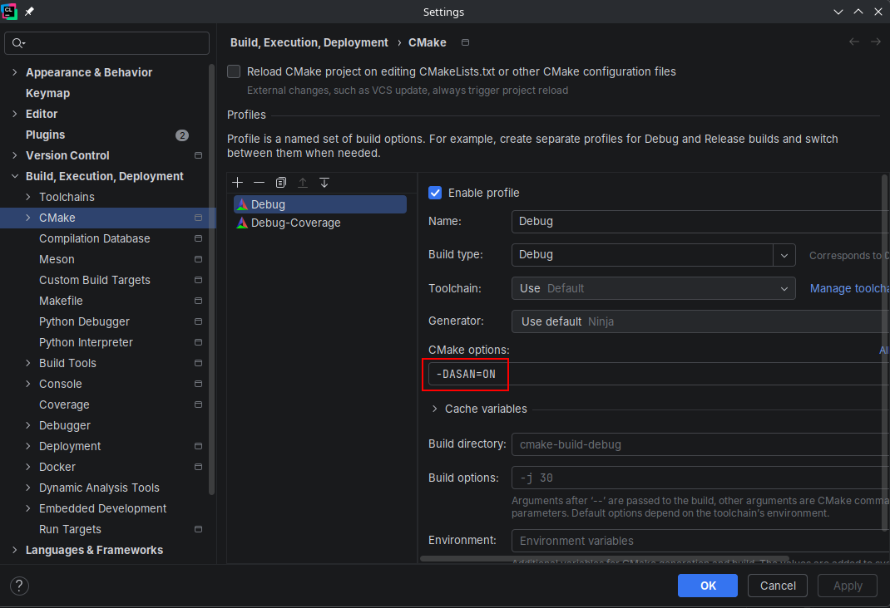

# Stack Exercise

Learning goals:
- Use pointers and references correctly.
- Function and operator overloading.
- Member functions and `const`-correctness.
- Scopes and namespaces.
- Source code structure across translation units.

Exercise goal:
- Implement a self-contained stack library without using other containers.

Stack is a basic data structure which involves dynamic memory in some way. Dynamic memory is managed by creating and destroying objects manually though pointers, which can spiral out of hand if not tackled properly early on. Therefore, we want to encapsulate and hide this pointer complexity while offering a safe and efficient interface using ***references***.

Compile-and-test the project using CMake without Clion:
```shell
cmake -B build-debug -DCMAKE_BUILD_TYPE=Debug -DASAN=ON
cmake --build build-debug --config Debug
ctest --test-dir build-debug --output-on-failure -C Debug
```

Compile-and-test the project using GCC/Clang without CMake (replace `c++` with C++23 compiler, like `g++-15`):
```shell
c++ -std=c++23 -g -Wpedantic -Wall -Wextra -fsanitize=address -fsatnize=undefined -o stack_test stack_test.cpp stack.cpp
./stack_test
```

Compile-and-test the project using Visual Studio without CMake:
```shell
& 'C:\Program Files\Microsoft Visual Studio\18\Community\Common7\Tools\Launch-VsDevShell.ps1'
cl /std:c++latest /W4 /Od /MDd /EHsc /Zi /fsanitize=address /RTCs /RTCu /Festack_test.exe stack_test.cpp stack.cpp
stack_test.exe
```

## Requirements

For simplicity, use `double` to store values but assume that the value type can be a *big* and ***expensive*** to copy, i.e. minimize the copying of elements as much as possible.

This project assumes that the `Stack` class is in the `stp` namespace (note `p`, not `std`!!), declared in [stack.hpp](stack.hpp) and implemented in [stack.cpp](stack.cpp), so your task is to follow this structure as much as possible.

See [stack_test.cpp](stack_test.cpp) how users are expected to use the library and implement the following stack operations so that `stack_test` passes:
- Check if the stack is empty.
- Get the top element of the stack (assume that the stack is not empty, use `assert` to express this assumption in the implementation code).
- Push an element to the top of the stack.
- Pop an element from the stack (assume that the stack is not empty, use `assert` to express this assumption in the implementation).
- Print the content of the stack.

Check for dynamic memory issues by enabling address sanitizer in the CMake profile: add `-DASAN=ON` to "CMake options"
(it turns on `-fsanitize=address` compiler and linker options in [CMakeLists.txt](CMakeLists.txt)).

Note: the sanitizers work only with native compilers, i.e. Visual Studio on Windows, GCC and Clang on Linux, AppleClang on macOS. Also, Visual Studio does not seem to catch memory leaks. 



If the sanitizer finds some memory leaks, then it's likely that the code is missing memory cleanup (perhaps add a destructor?).

## Extra

Generalize the Stack implementation by removing all the assumptions (like `assert` statements in the implementation):
1. Start with adding tests which negate those assumptions and expect (catch) `std::logic_error` exception.
2. Fix the implementation code to throw `std::logic_error` when assumptions do not hold.
3. Inspect the code coverage to see if there are more tests needed to cover the implementation. 
4. Add more tests to achieve 100% coverage (and fix the implementation if necessary).
